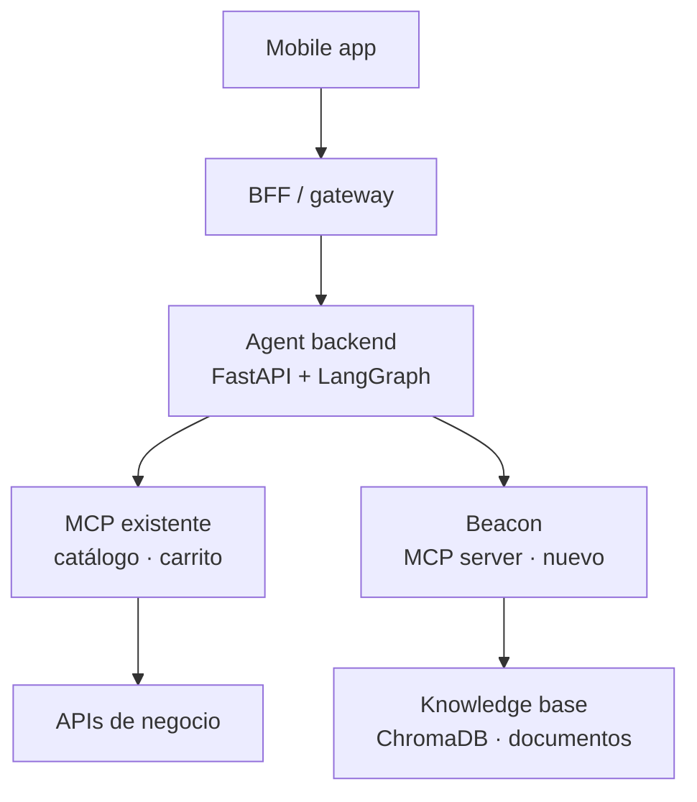
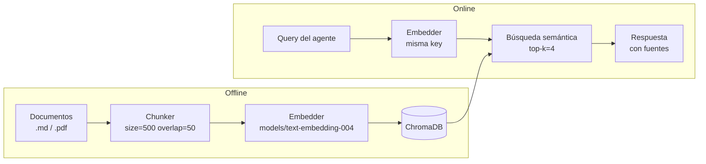

# Beacon

RAG-powered MCP server that acts as a knowledge base for conversational AI agents.

Built for the Alura Agentes challenge (Programa ONE) and designed to plug into an existing LangGraph-based agent via the Model Context Protocol.

## What it solves

A LangGraph agent can already search a product catalog and add items to a cart. When users ask informational questions — delivery hours, return policy, payment methods, coverage areas — the LLM would otherwise hallucinate or deflect. Beacon gives the agent a reliable tool to answer those questions from a structured, up-to-date knowledge base.

## Architecture



## RAG pipeline



## Stack

| Herramienta | Versión | Motivo |
|---|---|---|
| Python | 3.11 | Estable, soportado en Render |
| FastAPI | 0.115.5 | HTTP server, async-first |
| `mcp` | 1.1.2 | Protocolo MCP, FastMCP para definir tools |
| `langchain-mcp-adapters` | 0.1.1 | Cargar tools MCP en LangGraph |
| LangChain | 0.3.7 | RAG pipeline (loaders, splitter, retriever) |
| ChromaDB | 0.5.23 | Vector store local persistente |
| `langchain-google-genai` | 2.0.0 | LLM y embeddings de Google Gemini |
| `models/text-embedding-004` | — | Google, embeddings (768 dims) |
| LangGraph | 0.2.48 | Grafo ReAct para el demo del curso |
| pydantic-settings | 2.6.1 | Config desde .env |

## Quickstart

```bash
# 1. Clonar y crear entorno
git clone https://github.com/tu-usuario/beacon.git
cd beacon
python3.11 -m venv .venv
source .venv/bin/activate        # Windows: .venv\Scripts\activate
pip install -r requirements.txt

# 2. Configurar variables de entorno
cp .env.example .env
# Editar .env — mínimo requerido: GOOGLE_API_KEY

# 3. Ingestar documentos (genera ./chroma_db)
python scripts/ingest.py

# 4. Iniciar el servidor MCP
python app/main.py
# Beacon disponible en http://localhost:8000/sse
```

## MCP tool contract

```python
@mcp.tool()
async def search_knowledge_base(query: str) -> str:
    """
    Search Plub's knowledge base for FAQs, policies,
    delivery zones, operating hours, and payment methods.
    Returns a formatted answer with source references.

    Use this tool when the user asks informational questions
    that are not about specific products or cart operations.
    Examples: delivery hours, coverage area, return policy,
    accepted payment methods, how to contact support.
    """
```

El agente llama esta tool con una pregunta en lenguaje natural. Beacon la embedea, recupera los top-4 chunks más relevantes de ChromaDB y retorna un string formateado con la respuesta y las fuentes.

## LangGraph Studio

Inspeccionar el grafo demo localmente sin el servidor MCP:

```bash
langgraph dev
```

Abre LangGraph Studio en el browser. El grafo `beacon_demo` (configurado en `langgraph.json`) usa `search_knowledge_base` directamente como LangChain tool, sin necesidad de que el servidor MCP esté corriendo.

## Evals

```bash
python evals/eval.py
```

Corre 10 queries contra el knowledge base y reporta:

- **Keyword hit rate por query**: fracción de keywords esperados presentes en la respuesta
- **Avg hit rate**: calidad general de retrieval (target ≥ 80%)
- **Empty response rate**: fracción de queries sin resultados

Para agregar casos de prueba, editar `evals/qa_pairs.json`.

## Actualizar documentos

```bash
# 1. Editar o agregar archivos en docs/
# 2. Re-ingestar
python scripts/ingest.py
# 3. Reiniciar el servidor
python app/main.py
```

## Deploy en Render

1. Subir el repo a GitHub (puede ser público o privado).
2. En Render: **New → Web Service → Connect repo**.
3. Configurar:
   - **Build command**: `pip install -r requirements.txt`
   - **Start command**: `python scripts/ingest.py && python app/main.py`
4. Agregar variables de entorno desde `.env.example` en el dashboard de Render (`GOOGLE_API_KEY` es el mínimo requerido).
5. Deploy. La URL pública (`https://beacon-xxxx.onrender.com/sse`) es el valor de `MCP_SERVER_URL`.

### Por qué no OCI

`VM.Standard.E2.1.Micro` (1 GB RAM) se queda sin memoria instalando las dependencias ML (`chromadb`, `langchain`, `langchain-google-genai`). Las instancias `VM.Standard.A1.Flex` ARM (4 GB RAM) no tenían cupo disponible en la región al momento del deploy. Render en free tier provisiona en minutos y es suficiente para el entregable del curso — el requisito es solo tener una URL pública accesible.

## Estructura del proyecto

```
beacon/
├── app/
│   ├── main.py                   # Entry point — inicia servidor MCP SSE
│   ├── config.py                 # Settings (pydantic-settings + .env)
│   ├── rag/
│   │   ├── ingestion.py          # Load → chunk → embed → persist
│   │   ├── pipeline.py           # Retrieve → format response
│   │   └── vector_store.py       # Abstracción ChromaDB + embeddings
│   ├── tools/
│   │   └── search_kb.py          # Definición @mcp.tool()
│   └── agent/
│       └── demo.py               # Grafo ReAct demo (curso + LangGraph Studio)
├── docs/                         # Documentos fuente para indexar
│   ├── faq.md
│   ├── return_policy.md
│   ├── delivery_zones.md
│   └── payment_methods.md
├── scripts/
│   └── ingest.py                 # CLI de ingesta
├── evals/
│   ├── qa_pairs.json             # 10 pares pregunta / keywords esperados
│   └── eval.py                   # Script de evaluación
├── langgraph.json                # Config LangGraph Studio
├── Dockerfile
├── docker-compose.yml
├── requirements.txt
└── .env.example
```
